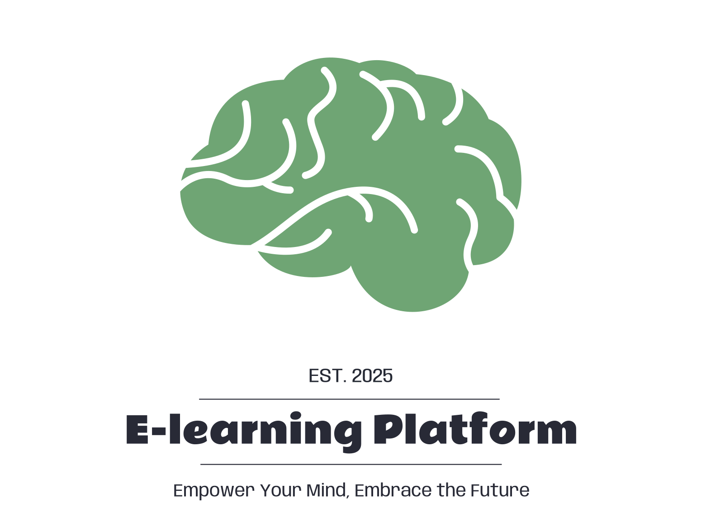

   

# E-Learning Platform

The **E-Learning Platform** is a robust web application for online education, developed using **Spring Framework v6**. It facilitates seamless collaboration between students, instructors, and administrators by providing a suite of features designed for modern e-learning environments. This platform offers tools for course creation, student progress tracking, and administrative management while ensuring a user-friendly experience for all roles.

---

## Features

### User Roles and Capabilities
1. **Unregistered Users**:
   - View general platform information and sample content without registration.
2. **Students**:
   - **Enroll in Courses**: Browse and enroll in available courses.
   - **Complete Lessons**: Mark lessons as finished to track progress.
   - **Quizzes and Assignments**:
     - Take quizzes linked to lessons or courses.
     - Submit assignments and receive instructor feedback.
   - **Groups**: Join student groups where students can collaborate
   - **Track Progress**: View a personalized dashboard showing completed lessons and quiz scores.
   - **Certificates**: Earn certificates after successfully completing courses.
   - **Support**: Create tickets for lesson or course issues.
   - **Events and News**: Be informed for upcoming events and news related to the learning process.

3. **Instructors**:
   - **Course Management**:
     - Create, edit, and delete courses.
     - Add lessons with multimedia content (e.g., videos, PDFs, images).
     - Assign quizzes, assignments, and student groups to courses.
   - **Student Management**:
     - Monitor student progress through dashboards.
     - Provide feedback on assignments.
     - Resolve student-created tickets.
   - **Analytics**:
     - View course performance analytics, including student success rates and quiz results.
   - **Events and Announcements**:
     - Create and manage events for specific dates.
     - Post course announcements.
4. **Administrators**:
   - **User Management**:
     - Create, edit, and delete users.
     - Assign user roles (Student, Instructor, or Administrator).
   - **System Oversight**:
     - Monitor platform activity logs.
     - Moderate courses, lessons, and user-created content (e.g., articles).
     - Create system-wide settings like categories, ranks, and announcements.
   - **Content Moderation**:
     - Review and delete inappropriate articles or posts.
   - **System-wide Features**:
     - Post news, manage upcoming events and make announcements.

### Core Functionalities
1. **Course Management**:
    - Create and edit courses with detailed descriptions, categories, prerequisites, and multimedia resources.
    - Finish lessons, take the quiz, pass it and receive the desired certificate.
2. **Participate in Groups**
    - Join the desired groups and find other students to discuss urgent topics.
    - Write articles and enjoy communicating while studying together.
3. **Progress Tracking**:
    - Track student progress at both course and lesson levels.
    - Provide feedback and analytics on course performance.
4. **Interactive Learning**:
    - Quizzes, assignments, and tickets for engaging and responsive education.
    - Events and announcements to enhance community interaction.
5. **Certificates**:
    - Automatically issue certificates upon successful course completion.
6. **Dashboard and Analytics**:
    - Personalized dashboards for students, instructors, and administrators.
    - Visualize progress, performance, and overall platform statistics.
7. **Group Collaboration**:
    - Students, instructors, and administrators can create and manage groups.
    - Add articles and discussions within groups.
8. **Announcements and News**:
    - Publish announcements specific to courses or system-wide.
    - View latest news updates in the dashboard.
9. **Events**:
    - Schedule events and notify relevant users.
    - View upcoming events on the Events tab.

---

## Technologies Used

### Backend
- **JAVA & Spring Framework v6**: For building RESTful services.
- **Spring Security**: Ensuring robust authentication and authorization.
- **JSON Serialization**: Facilitates seamless client-server communication.
- **MVC Architecture**

### Frontend
- **Thymeleaf**: Used for server-side rendering of web pages.

### Database
- **MySQL**: Structured data storage with optimized queries for educational use cases.

### Others
- **Build Tool**: Gradle for streamlined builds and dependencies.

---

## Usage

### How to Get Started
1. **Registration**:
   - Unregistered users can sign up with their email, first and last name, and password.
   - Administrators can assign roles during user creation.
2. **Login**:
   - Secure authentication with email and password.
3. **Browsing Courses**:
   - Explore available courses and lessons based on user roles.
4. **Enroll and Learn**:
   - Students enroll in courses, complete lessons, and mark them as finished.
   - Track progress and earn certificates after completing quizzes and assessments.
5. **Create Content**:
   - Instructors create courses with multimedia-rich lessons and assign quizzes to student groups.
6. **Admin Capabilities**:
   - Manage users, content, and settings.
   - Monitor logs and resolve disputes.

---
